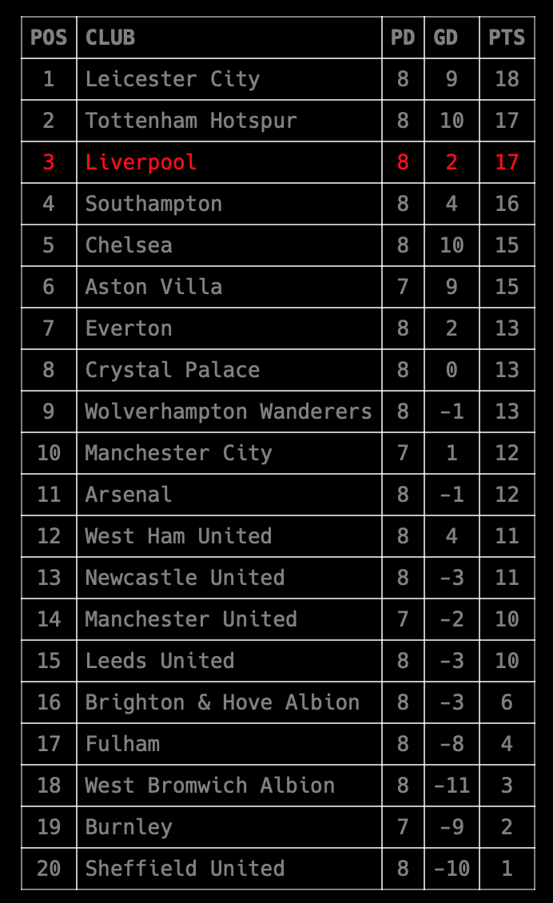

# Ubersicht-Widgets: Premier League Table

Premier League Widget for Ubersicht http://tracesof.net/uebersicht-widgets/

This is based on a widget I found somewhere a long time ago, which stopped working, so I completely re-wrote it. I don't remember where I found the original (not that this contains anything from the original Python code any longer) and I can't find it now. If you come across the old, non-functional one, let me know and I'll credit the original here for giving me the idea. Turns out, it wasn't ever an Ubersicht widget, it was for something else entirely and I made it into an Ubersicht widget.

Anyway, you'll need to visit https://www.footballwebpages.co.uk to sign up for a free account to get an API key. Then open the premier-league.py file in your favorite editor and put your API key in there (where it says **YOUR_API_KEY**).

**Update:** The competition is now configurable, but defaults to the English Premier League. A list of competitions and their Id information is listed below. Should you wish a different table than the default, just change the **COMP_ID** variable with one of the IDs from the table below.

If you want to color your favorite team, you'll need to change the **MY_TEAM_NAME** variable, and if you want to change the highlight color for your team, look in the index.coffee file for the *mightiest* and *mightyclass* sections.

Then put all this stuff in your local Ubersicht widgets directory. Either git clone the thing or download an archive, it's up to you.

## Requirements

I use Python from Mac Ports, which installs all it's bits and pieces in `/opt/local`, so if you don't use this and your Python is somewhere else, you'll need to change the path to your Python binary at the top of the Python script. Also, you'll need the following Python libraries:

```Python
urllib
json
requests
```

## Screenshot




## Competition IDs

| Competition                                   | Id  |
| ---                                           | --- |
| Premier League                                | 1   |
| Championship                                  | 2   |
| League One                                    | 3   |
| League Two                                    | 4   |
| Scottish Premiership                          | 17  |
| Scottish Championship                         | 18  |
| Scottish League One                           | 19  |
| Scottish League Two                           | 20  |
| National League                               | 5   |
| National League North                         | 6   |
| National League South                         | 7   |
| Northern Premier League - Premier Division    | 14  |
| Northern Premier League - South East Division | 15  |
| Northern Premier League - North West Division | 16  |
| Isthmian League - Premier Division            | 11  |
| Isthmian League - North Division              | 12  |
| Isthmian League - South Central Division      | 13  |
| Isthmian League - South East Division         | 40  |
| Southern League - Premier Central Division    | 8   |
| Southern League - Premier South Division      | 39  |
| Southern League - Division One Central        | 9   |
| Southern League - Division One South          | 10  |
| FA Cup                                        | 21  |
| League Cup                                    | 22  |
| Scottish Cup                                  | 23  |
| UEFA Champions League                         | 24  |
| UEFA Europa League                            | 25  |
| EFL Trophy                                    | 28  |
| Scottish League Cup                           | 32  |
| FA Trophy                                     | 27  |
| Scottish Challenge Cup                        | 33  |
| Internationals                                | 26  |
| Northern League Cup                           | 36  |
| Isthmian League Cup                           | 35  |
| Southern League Cup                           | 34  |
| French Ligue 1                                | 91  |
| German Bundesliga                             | 92  |
| Italian Serie A                               | 93  |
| Spanish La Liga                               | 94  |
| Belgian First Division A                      | 95  |
| Dutch Eredivisie                              | 96  |
| Portuguese Primeira Liga                      | 97  |
| Russian Premier League                        | 98  |
| Turkish Süper Lig                             | 99  |
| Irish Premier Division                        | 100 |
| Welsh Premier League                          | 101 |
| Women's Super League                          | 102 |
| Women's Championship                          | 103 |
| Women's National League North                 | 104 |
| Women's National League South                 | 105 |
| Women's FA Cup                                | 106 |
| Women's League Cup                            | 107 |
